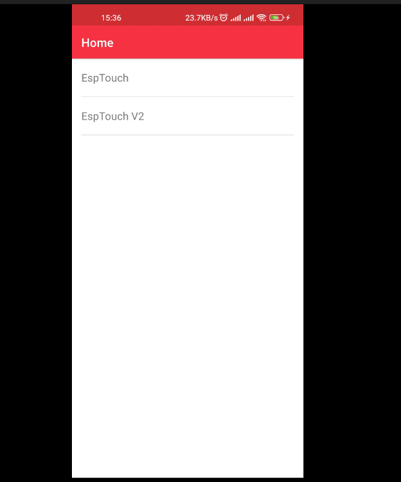
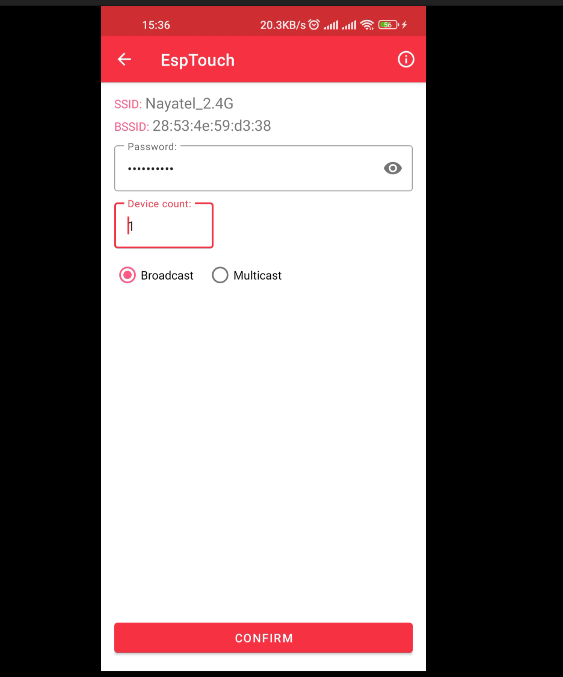
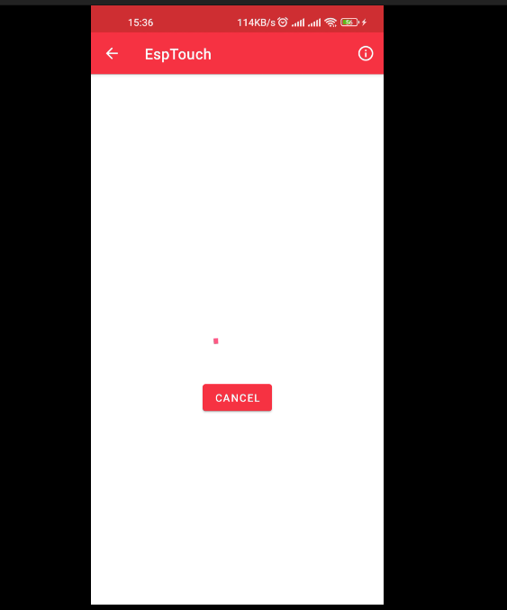
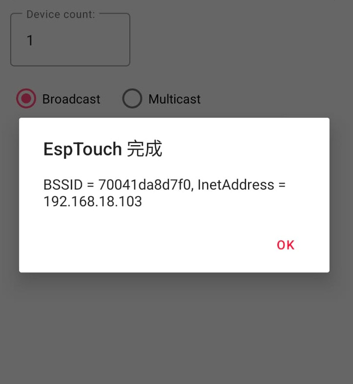

# WiFiConfigManager

WiFiConfigManager is a flexible and easy-to-use library for managing WiFi connections on ESP32 devices. It provides smart configuration options, fallback mechanisms, and persistent storage of WiFi credentials.

## Features

- Smart Config for easy WiFi setup
- Fallback to default credentials if Smart Config fails
- Persistent storage of WiFi credentials using Preferences
- Support for clearing stored preferences
- Easy integration with Arduino framework projects

## Installation

### PlatformIO

1. Open your project in PlatformIO
2. Add the following line to your `platformio.ini` file:

```ini
lib_deps = WiFiConfigManager
```

3. PlatformIO will automatically install the library when you build your project

## Usage

Here's a basic example of how to use WiFiConfigManager:

```cpp
#include <Arduino.h>
#include <wifi_config_manager.h>

const String DEFAULT_SSID = "Default_SSID";
const String DEFAULT_PASSWORD = "Default_Password";
const bool SHOULD_CLEAR_PREFERENCES = false;

WiFiConfigManager wifiManager(DEFAULT_SSID, DEFAULT_PASSWORD, SHOULD_CLEAR_PREFERENCES);

void setup() {
    Serial.begin(115200);
    wifiManager.begin();
}

void loop() {
    if (wifiManager.isConnected()) {
        // Your code here
    }
}
```

## How to Add Credentials

To add WiFi credentials to your ESP32 device using the Smart Config feature, follow these steps:

1. Download and install the ESPTouch app on your Android device:
   [ESPTouch on Google Play](https://play.google.com/store/apps/details?id=com.fyent.esptouch.android&hl=en)

2. Ensure your Android device is connected to the WiFi network you want to share with your ESP32.

3. Open the ESPTouch app.

4. Enter the password for your WiFi network in the app.

5. Power on your ESP32 device with the WiFiConfigManager running.

6. In the ESPTouch app, tap the "Confirm" or "Broadcast" button to start sending the credentials.

7. The ESP32 will listen for the Smart Config broadcast for one minute. During this time, it should receive and save the credentials.

8. If successful, your ESP32 will connect to the WiFi network, and the `isConnected()` method will return true.







Note: The Smart Config process uses your phone to broadcast the WiFi credentials. Ensure you're in a secure environment when using this feature.

## API Reference

- `WiFiConfigManager(const String& defaultSSID, const String& defaultPassword, bool shouldClearPreferences)`
  - Constructor for WiFiConfigManager
- `void begin()`
  - Starts the WiFi connection process
- `bool isConnected()`
  - Returns true if connected to WiFi, false otherwise

## Contributing

Contributions to WiFiConfigManager are welcome! Please feel free to submit a Pull Request.

## License

This library is licensed under the MIT License. See the [LICENSE](LICENSE) file for details.

## Authors

- Ibrahim
- Shan
- KytherTek

## Support

If you encounter any problems or have any questions, please open an issue on the [GitHub repository](https://github.com/ibrahimmansur4/wifi_config_manager).